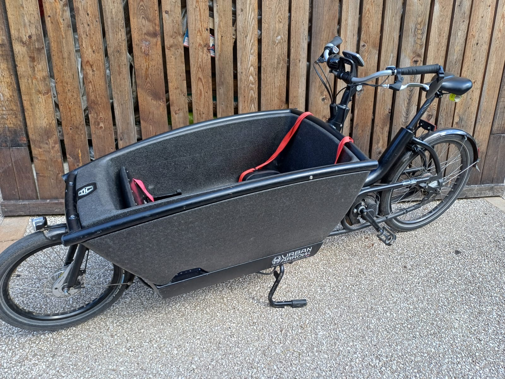

# Optimisation des Images - Vélos BIBI

## ✅ OPTIMISATION TERMINÉE (15 février 2026)

**Résultats de la compression :**
- **Avant :** ~18 Mo (images velo_10 à velo_14) + ~3.3 Mo (autres) = **~21.5 Mo total**
- **Après :** 6.6 Mo total pour toutes les images velo_*.jpeg
- **Réduction :** ~69% de réduction globale

**Détails par image :**
- velo_10: 4.3M → 608K (réduction 86%)
- velo_11: 3.1M → 472K (réduction 85%)
- velo_12: 2.9M → 445K (réduction 85%)
- velo_13: 3.5M → 561K (réduction 84%)
- velo_14: 4.4M → 631K (réduction 86%)
- velo_1 à velo_8: optimisées avec qualité 80%

## État initial (avant optimisation)

### Analyse des images

**Images légères (< 500 Ko) :**
- Logo.jpeg : 27 Ko ✅
- velo_1.jpeg : 452 Ko
- velo_2.jpeg : 428 Ko
- velo_3.jpeg : 444 Ko
- velo_4.jpeg : 489 Ko
- velo_5.jpeg : 443 Ko
- velo_6.jpeg : 383 Ko
- velo_8.jpeg : 317 Ko

**Images très lourdes (> 2 Mo) - À OPTIMISER URGENCE :**
- velo_10.jpeg : **4.3 Mo** (affichée en 300x200px)
- velo_11.jpeg : **3.1 Mo** (affichée en 300x200px)
- velo_12.jpeg : **2.9 Mo** (affichée en 300x200px)
- velo_13.jpeg : **3.5 Mo** (affichée en 300x200px)
- velo_14.jpeg : **4.4 Mo** (affichée en 300x200px ou 400x300px)

**Autres images :**
- Logo_detoure.png : 222 Ko
- Logo_fond_beige.jpeg : 226 Ko

### État actuel du lazy-load

✅ **Déjà en place :**
- Toutes les images de la galerie (realisations-galerie.html) ont `loading="lazy"`
- Toutes les images des cartes (index.html) ont `loading="lazy"`
- Toutes les images ont `decoding="async"`
- Toutes les images ont `width` et `height` définis

✅ **Correctement configuré :**
- Logo_fond_beige.jpeg (hero) : **PAS de lazy-load** (correct, image au-dessus de la ligne de flottaison)

## Recommandations d'optimisation

### 1. Compression des images lourdes (PRIORITÉ)

**Images à traiter en priorité :**
- velo_10.jpeg (4.3 Mo → cible : < 150 Ko)
- velo_14.jpeg (4.4 Mo → cible : < 150 Ko)
- velo_13.jpeg (3.5 Mo → cible : < 150 Ko)
- velo_11.jpeg (3.1 Mo → cible : < 150 Ko)
- velo_12.jpeg (2.9 Mo → cible : < 150 Ko)

**Méthode recommandée :**
```bash
# Avec ImageMagick (si disponible)
for img in velo_10 velo_11 velo_12 velo_13 velo_14; do
  convert assets/img/${img}.jpeg -resize 800x600 -quality 85 -strip assets/img/${img}_optimized.jpeg
done

# Ou avec jpegoptim (si disponible)
jpegoptim --max=85 --size=150k assets/img/velo_*.jpeg
```

**Objectif :** Réduire la taille totale des images de ~18 Mo à < 3 Mo (réduction de 85%)

### 2. Conversion WebP (optionnel mais recommandé)

**Avantages :**
- Réduction supplémentaire de 25-35% par rapport au JPEG optimisé
- Support moderne (tous navigateurs sauf IE11)

**Méthode :**
```bash
# Avec cwebp (Google)
for img in velo_*.jpeg; do
  cwebp -q 85 "$img" -o "${img%.jpeg}.webp"
done
```

**Mise à jour HTML :**
Utiliser `<picture>` avec fallback :
```html
<picture>
  <source srcset="assets/img/velo_10.webp" type="image/webp">
  
</picture>
```

### 3. Redimensionnement selon usage réel

**Dimensions actuelles vs dimensions d'affichage :**

| Image | Affichage | Recommandation |
|-------|-----------|----------------|
| Galerie (realisations) | 300x200px | Redimensionner à 600x400px (2x pour Retina) |
| Cartes (index) | 400x300px | Redimensionner à 800x600px (2x pour Retina) |
| Hero logo | 400x200px | OK (226 Ko) |

**Note :** Les images actuelles sont probablement en très haute résolution (4000px+). Redimensionner aux dimensions réelles d'affichage × 2 pour les écrans Retina.

### 4. srcset pour responsive (bonus)

Pour les images des cartes (index.html), ajouter srcset :
```html

```

## Impact attendu

**Avant optimisation :**
- Total images : ~18 Mo
- Temps de chargement (3G) : ~45-60 secondes
- LCP (Largest Contentful Paint) : Dégradé

**Après optimisation :**
- Total images : ~2-3 Mo
- Temps de chargement (3G) : ~5-8 secondes
- LCP : Amélioration significative
- Réduction : **~85%**

## Actions immédiates

1. ✅ Lazy-load : **Déjà en place** - Aucune action nécessaire
2. ⚠️ Compression : **URGENT** - Les images velo_10 à velo_14 doivent être compressées
3. 📝 Documentation : Ce fichier sert de référence

## Outils recommandés

- **En ligne :** TinyPNG, Squoosh.app
- **CLI :** jpegoptim, ImageMagick, cwebp
- **Automatisation :** Script de build avec sharp (Node.js) ou Pillow (Python)
